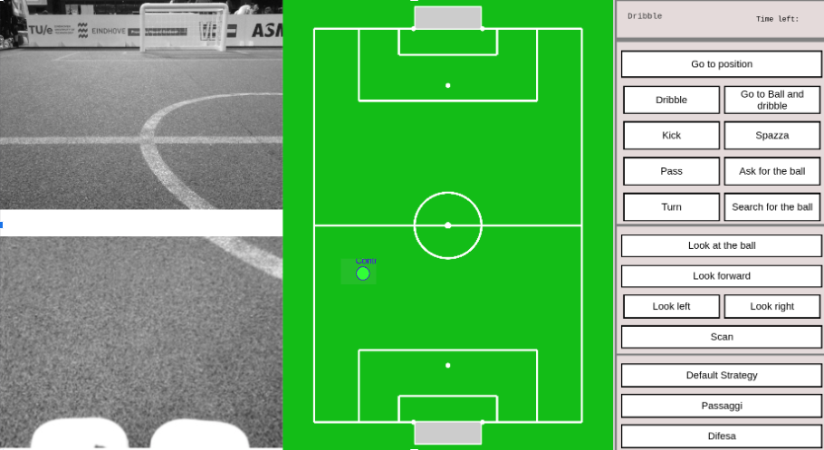

$$\color{Orange}{\texttt{\huge Luigi RoboCup Challenge}}$$




This is a small project implementing a graphical interface united with a communication pipeline with a nao robot to control it. This code has a counterpart in c++ which takes care of the other side, namely physically executing the commands and communicating the perceptions.

## 

## Commands

We send to the robot a tuple of three values: body command, head command, a strategy and a 2D position on the field. The command is identified by a unique number identifier and the position on the field usually indicates a point to reach or to kick the ball to. For now, there is no direct steering of the body movements, due to to possible latency of the network, or difficulties of the operator to understand the whole situation in real-time. Instead, we opted for a “Go to position” type of command which takes the position target.

## Observations

Information from the cameras is received, processed and sent to the operator’s interface through a web socket on a point-to-point connection. The received data contains obstacles, teammates, the position of the controlled robot, the observations on the landmarks. This data is then saved in a ring buffer in python, such that we have observations of the last N instants. More importantly, the information is shown on a 2D field representation on the graphical interface.

## Graphical Interface

- 2D field:
  - the controlled robot
  - the teammate
  - the opponents
  - the line of the passage between the controlled robot and the teammate (TODO)
  - the line that connect the teammate with the opponent goal (TODO)
  - the path planner (TODO)

- A set of buttons:
  - go to a point
  - go to ball
  - pass the ball
  - kick the ball on a point (and the point should be provided clicking on the 2D field)
  - dribble to reach a point (and the point should be provided clicking on the 2D field)
  - scan with the head (moving one time to left and one time to right, or moving the head left and right for X seconds)
  - search the ball

## 

## Possible Future expansions

### Low level control
- move the robot using WASD/arrows or the joypad (the robot should return on the original path when the command isn't provided anymore?)
- change the parameters of the path planner (e.g. increase/decrease the minimum distance to avoid obstacles, i.e. be more conservative/rough)
- increase/decrease the speed of the robot

## Dependencies

### Speech Recognition

```
sudo apt-get install portaudio19-dev python-all-dev python3-all-dev
```