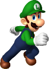

$$\color{Orange}{\texttt{\huge Luigi RoboCup Challenge}}$$

# Motion

## Robot motion

### High level control
- Tactics and strategies
  -  Characteristics: 
    -  triggered through buttons
    -  should send a packet to the autonomous robot 

### Mid level control
- Go to ball 
 - Skills: 
   - Walk to ball, 
   - Go to ball and pass, 
   - Go to ball and dribble,
   - Intecept the ball
 - Characteristics:
   - look at the ball unless are provided different commands for the head motion,
   - triggered through buttons 
- Go to point 
 - Skills: 
   - Go to point
 - Characteristics: 
   - look at point unless are provided different commands for the head motion,
   - triggered through clicking on the 2D field

### Low level control
- move the robot using WASD/arrows or the joypad (the robot should return on the original path when the command isn't provided anymore?)
- change the parameters of the path planner (e.g. increase/decrease the minimum distance to avoid obstacles, i.e. be more conservative/rough)
- increase/decrease the speed of the robot

## Head motion
The robot should always look forward or at the ball unless the human provides commands to move the head.
When the command is not provided anymore, the robot head should returns to the original position (look forward/look at the ball)
The commands can be provided using the arrows keys of the keyboard or the joypad and moving the head directly to a predefined angle (in pan/tilt), or moving incrementally it (e.g. 5° at time).

# Interface
On the screen must be present
- a 2D field showing:
    - the controlled robot
    - the teammate
    - the opponents
    - the line of the passage between the controlled robot and the teammate
    - the line that connect the teammate with the opponent goal
    - the path planner
- a set of buttons:
    - go to a point
    - go to ball
    - pass the ball
    - kick the ball on a point (and the point should be provided clicking on the 2D field)
    - dribble to reach a point (and the point should be provided clicking on the 2D field)
    - scan with the head (moving one time to left and one time to right, or moving the head left and right for X seconds)
    - search the ball
- the ball model
    - the ball is currently in the image of the controlled robot (active perception)
    - the ball is currently in the image of the teammate (is it possible?) (passive perception)
    - the ball model was updated X seconds ago (by the controlled robot/by the teammate/both ?)
- the obstacle model
    - how many obstacles are in the image of the controlled robot (active perception)
    - how many obstacles are in the image of the teammate (is it possible?) (passive perception)
    - the obstacle model was updated X seconds ago (by the controlled robot/by the teammate/both ?)
- the current time of the game 